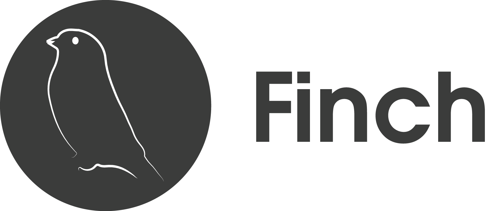
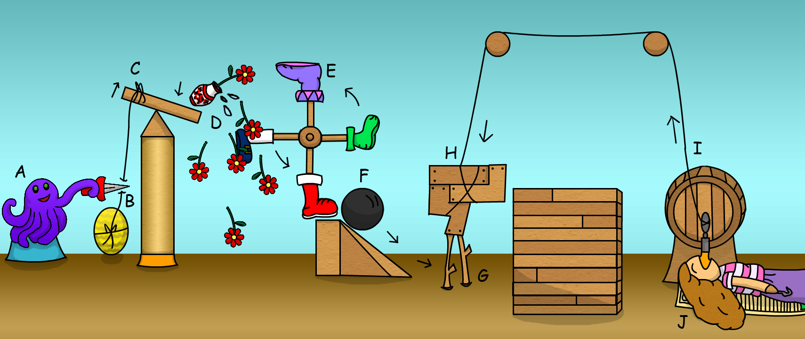

# Micro Service Orchestration

### A Functional Approach
#### Andrew Kuhnhausen - FinagleCon 2015
##### @kuhnhausen | github.com/trane | blog.errstr.com

---

# Agenda

---

## Back Story

---

## Primitives




---

## Building Abstractions

---

# About Me

---

## work

* Engineer at 
* Created Functional Programming study groups (currently working through Functional Programming in Scala)
* Diversity Committee (let's talk)
* Moving to work on Functional infrastructure
* We are hiring - come ride the Curry-Howard correspondence with us

---

## academia

* Static Analysis of Dalvik Bytecode for Malware Detection
* University of Utah, advisor: Matt Might

---

## why you should (not) listen

* This is my first conference talk
* I'm not an expert in Scala nor typed FP
* Lessons from building an idiomatic Scala open-source FP library
* Some of this won't work in Java* 

*better compiler required

---

# Some(Context)

^ It's a story as old as time

---

## ruby + rails
### ...a love story


^ a well intentioned group of people start using rails

---

### true luv 4ever!!1


^ and then they use it some more, 'cause they love it so much

---

### tests will keep us 2gether :) :) :)


^ and then they keep using it... until one day

---

### elho? ping? ack? ... silence


^ you realize that you've built a monolithic rails service that falls down under the success you've had. of course, you know the answer to this...

---

## servicesus minimus
### servii? servi?


^ it's micro services and they are great! building small, understandable components in the hope to make testing and development of new features faster and simpler is fantastic

---

## now you've just moved complexity


^ This simplification at the service layer pushes the complexity cost to components in the service orchestration layer.

---

## orchestration


* compose sessions
* allow for plugabble/modular authentication
* abstract away service discovery for clients

^ the goal of this talk is to tell a story about my attempt at building some hopefully useful functional abstractions on top of the excellent primitives that finagle and finch provide, in the spirit that more people will do that same thing. and that we can build a community of modern, idiomatic fp in scala libraries.

---

# context achieved!


^ ok, cool... let's talk about stuff

---

# Functional Approach

^ let's talk about a way we can model Sessions

---

## sessions

```scala
trait SessionId {
  val expiry: Time
  val entropy: Seq[Byte]
  val secret: Secret
  val signature: Seq[Byte]
}

trait Session[A] {
  val id: SessionId
  val data: A
}
```

---

## why inheritance isn't good enough

```scala
trait Mammal {
  // implement mammal
}

case object Human extends Mammal
case object Cat extends Mammal
```

---

## inheritance for end users

### define a general type and silently accept more specific types (subtypes)

----

### shoe store

```scala
trait ShoeStore {
  def get(m: Mammal): Kicks
}
```

---

### others want our shoes

```scala
case object Bird extends Animal
case object Lizard extends Reptile
case object Velociraptor extends Bird with Lizard

ShoeStore.get(pureApplesauce) // compile error :(
```

---

## interfaces

### define a specific description and siltently allow more general types

---

## icanhazshoes?

* Anything with feet can (probably) wear shoes
* Support `Reptile`, `Bird`, `Mamamal`, `ImperialMetrics`

---

### adapter pattern

---

### adapter pattern

interface membership is determined at definition

---

## monkey patching

^ in ruby, we could just monkey patch

---

## type classes

^ In Functional Programming, we have the best of both worlds: program to an interface and - the spirit in which monkey-patching happens - ad-hoc polymorphism.

---

# Sessions

```scala
trait Session[A] {
  val id: SessionId
  val data: A
}
```

---

## interface

^ What we need is some function that can convert the `data` a user of our library wants to store into the type that our backend stores: `A => B`. We also need some way to convert from what was stored into what the user expects: `B => Option[A]`.

---

## laws

* `A => B`
* `B => Option[A]`

---

### define the general law

```scala
trait Encoder[A, B] {
  def apply(a: A): B
  def unapply(b: B): Option[A]
}
```

---

### define a less general law

^ Finagle already has a data type that is used throughout their various protocol implementations: `Buf`. This type is a nice wrapper for a `Array[Byte]` with many helper methods for types like `String`, `Utf8`, `U32`, etc.

---

### Buf

```scala
type EncodeSession[A] = Encoder[A, Buf]

// or

trait EncodeSession[A] {
  def apply(data: A): Buf
  def unapply(buf: Buf): Option[A]
}

```

^ So, knowing that we are building on top of Finagle, and we are dealing with `Session[A]`, we can simplify that trait to require Buf. This opinionated part of the design is a trade-off for ease of use over flexibility.

---

## defaults


^ We already know that part of Border Patrol's functionality is to save the location that an unauthenticated user tried to access so that we can send them their directly after logging in. So, we need an implementation for the initial `Request`

---

## EncodeSessionRequest

```scala
implicit object EncodedSessionRequest 
    extends EncodeSession[httpx.Request] {
  
  def apply(data: httpx.Request): Buf = 
    Buf.ByteArray.Owned(data.encodeBytes())
  
  def unapply(buf: Buf): Option[httpx.Request] = 
    Try { Request.decodeBytes(Buf.ByteArray.Owned.extract(buf)) }.toOption
}
```

^ This is another really nice example of utilizing Request and Buf. The first iteration of this that I did, I encoded it into Json and then to a byte array.

---

## use the type class

```scala
trait SessionStore {
  def put[A : EncodeSession](session: Session[A]): Future[Unit]
  def get[A : EncodeSession](id: SessionId): Future[Option[Session[A]]]
}
```

---

### a simple memcached implementation

```scala
case class MemcachedSessionStore(store: memcachedx.BaseClient[Buf]) 
    extends SessionStore {
  def put[A : EncodeSession](session: Session[A]): Future[Unit] =
  	 store.set(session.id, 0, 60, implicitly[EncodeSession[A]](session.data))
  	 
  def get[A : EncodeSession](id: SessionId): Future[Option[Session[A]]]
     store.get(id).map {opt =>
       opt.flatMap {buf => 
         Session(id, implicitly[EncodeSession[A]].unapply(buf))
       }
     }
}
```

^ how easy would it be to implement a Redis backend or any other Backend? This is the power from Finagle.

---

## what just happened?

^ Now, `Session` and `SessionStore` only care about a contract of two functions to work with any type of data that a user wants to cache with their session. Users can implement this functionality for any type, even those they don't define!

---

## more advanced fun-time

### `Session[A] + Functor[F[_]] + Free Monad

^ `Session[A]` can be lifted into a `Functor[Session[_]]`
Once we have a functor, we can define an interpreter for our database operations using the Free Monad
Now `get` and `put` become actual types of `Get` and `Put` and we can know even more about the behavior at compile-time
Feel free to implement this for fun, we are accepting pull requests

---

# Primitives

^ Knowing how easy it is to implement any backend store for our Session interface, let's go a bit deeper into the primitives that both Finagle and Finch give us to see why

---

## Finagle
### Service 

```scala
type Service[Req, Rep] = Req => Future[Rep]
```

### Filter

```scala
type Filter[ReqIn, RepOut, ReqOut, RepIn] =
  (Req, Service[ReqOut, RepIn]) => Future[RepOut]
```

^ these types boil down to simple partial functions, and applying a filter to a service yields a service. this works really simply for RPC like Thrift or Protobufs. The problem comes when you have to deal with HTTP, where the protocol is so general that you end up with a lot of messy code that can't be checked at compile time.

---

## Finch

### Router
```scala
type Router[A] = Request => Option[A]
```

### RequestReader
```scala
type RequestReader[A] = Request => Future[A]
```

### ResponseBuilder
```scala
type ResponseBuilder[A] = (A, EncodeResponse[A]) => Response
```
^ finch lifts the request type in some higher-order functions that allow us to encode those possibilities into value types that compose together. this is the level that we want to be working at for HTTP

---

# Lessons in Composability

^ Finch takes an idiomatic scala approach to a functional library, this is where I learned a lot about defining types in a general and composable way.

---

## Router Combinator

```scala
type Router[A] = Request => Option[A]
```

^ in a low-level, routers can be treated as a simple function from a Request to an Option of some generic type

---

## Combinator DSL

```scala
// GET /users/:id/tickets/:id
get("users" / int("userId") / "tickets" / int("ticketId"))
```

---

## Using these primitives

---

### Router for Path based Service
`http://example.com/:service/`

---

### Router for Subdomain based default Service
`http://service.example.com/`

---

## Path based Service

```scala
val services = Set("enterprise", "consumer")

def validate(s: String, services: Set[String]): String = 
  (services & Set(s)).head

object servicePath extends Extractor("service", s => validate(s, services))
```

---

## Subdomain based

```scala
case class DefaultServiceDomain(g: String => Option[String])
    extends Extractor[String]("defaultService", identity) {

  import Router._

  override def apply(input: Input): Option[(Input, () => Future[String])] =
    for {
      h <- input.request.host
      s <- g(h)
    } yield (input.drop(1), () => Future.value(s))
}

val subdomain = DefaultServiceDomain(s => validate(s, services))
```

---

## Compose them

```scala
val service = servicePath | subdomain
```

---

## What this looks like

```scala
val endpoints = (
  (Get / service /> AuthenticatedEndpoint) :+:
  (Post / "login" /> LoginService))
)

val server = Httpx.serve("localhost:8080", endpoints.toService)
```

---

# Contributing to the community

